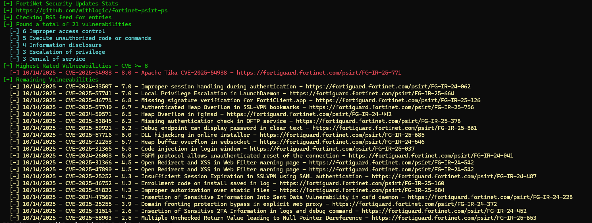

# fortinet-psirt-ps
This script retrieves the list of vulnerabiltiies from FortiGuard Lab's [PSIRT RSS feed](https://www.fortiguard.com/rss-feeds).     
It returns the date the vulnerability was published, the CVE ID, CVSS3 score, and the title of the vulnerability



Inspired by the MSRC-PatchReview project:
[https://github.com/f-bader/MSRC-PatchReview](https://github.com/f-bader/MSRC-PatchReview)

## Usage

To get a report, just run the script without any additional parameters. Note that FortiGuard Lab's PSIRT RSS feed only includes the most recent items.

```bash
$ .\fortinet_psirt_patch_review.ps1
```

### Change output format

Default is **human-readable** which will write the output to stdout. But if you would like to use the data in any way after the script is run you can use either **json** or **psobject**.

```bash
$ .\fortinet_psirt_patch_review.ps1 -Output json
```

```bash
$ .\fortinet_psirt_patch_review.ps1 -Output psobject
```

### Change CVE BaseScore

The highest rated CVEs are by default all CVEs above **8.0**. This can be changed easily to fit your needs.

```bash
$ .\fortinet_psirt_patch_review.ps1 -BaseScore 6
```

### Filter on Products

Default is all products, but you can filter the results by specific product verions or product families. Multiple products can be filtered if they are in a comma-separated list.

```bash
$ .\fortinet_psirt_patch_review.ps1 -ProductFilter "FortiOS 7.4"
```

```bash
$ .\fortinet_psirt_patch_review.ps1 -ProductFitler "fortios, fortimail"
```

```bash
$ .\fortinet_psirt_patch_review.ps1 -ProductFitler "FortiOS 7.4, fortimail"
```

### Bypass product information lookup

By default the script will extract impacted products and present them as part of the result set. This can be bypassed.

```bash
$ .\fortinet_psirt_patch_review.ps1 -ExcludeProducts
```

Bypassing the product extraction can make the script quicker to execute and may be a good idea if specific product information is not needed.